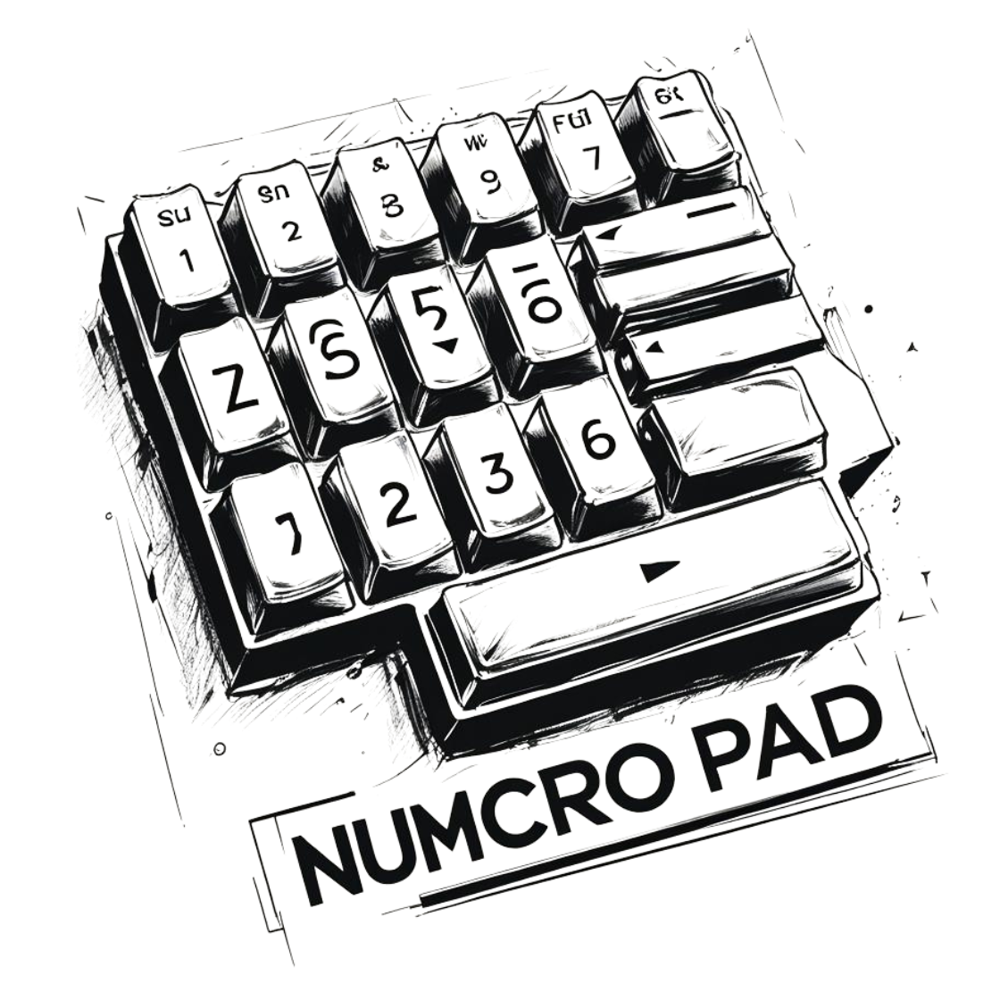
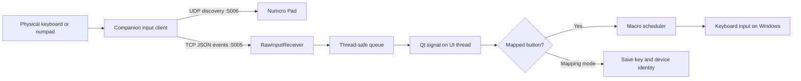

# Numcro Pad

<p align="center">
  
</p>

<p align="center">
  A configurable Windows macro-pad designer that maps physical input events to recorded keyboard automations.
</p>

<p align="center">
  
  
  
  
</p>

## Overview

Numcro Pad is a Windows desktop application for designing virtual macro-pad layouts and connecting them to physical keys. It receives structured input events from a companion device on the local network, matches those events to user-defined buttons, and executes recorded keyboard macros.

The project combines desktop UI development, network communication, concurrency, device-aware input mapping, and persistent configuration in one application. A typical setup uses a Raspberry Pi or another lightweight client to forward keyboard or numpad events to the Windows app.

## Key features

- **Visual layout designer** — build grids from 1×1 up to 20×20 and combine adjacent cells into named virtual buttons.
- **Physical key mapping** — select a virtual button, enter mapping mode, and bind the next incoming key event.
- **Device-aware mappings** — optionally distinguish identical key names by vendor ID, product ID, and device name.
- **Macro recording and editing** — capture global keyboard events with timing and key-hold duration, then review or edit the stored JSON.
- **Concurrent macro playback** — execute timed press and release events without blocking the interface.
- **Turbo mode** — repeat an assigned macro while its mapped physical key remains pressed, with a configurable interval.
- **Reusable layouts** — save and load grid dimensions, button geometry, mappings, macro assignments, and turbo settings as JSON.
- **Background operation** — minimize to the system tray, restore the window from the tray, or launch a selected layout at Windows startup.
- **Single-instance behavior** — a second launch activates the existing application instead of opening a duplicate process.
- **Network discovery** — advertises the Windows receiver to companion clients over UDP and accepts newline-delimited JSON events over TCP.

## How it works



`RawInputReceiver` runs independent threads for TCP clients, UDP discovery, and queued event processing. Events cross into the PyQt UI through signals, keeping widget updates on the main thread. The mapping engine then filters events by key and, when enabled, by device identity before starting normal or turbo macro playback.

## Tech stack

| Area | Technology |
| --- | --- |
| Language | Python 3.12+ |
| Desktop UI | PyQt5 |
| Input automation | `keyboard` |
| Networking | Python TCP/UDP sockets |
| Concurrency | Threads and a thread-safe queue |
| Windows integration | `pywin32` and `winshell` |
| Configuration | JSON |

## Getting started

### Requirements

- Windows 10 or Windows 11
- Python 3.12 or newer
- A companion client that sends supported input events to the PC
- Both devices on the same trusted local network when using a remote input client

Python 3.12+ is recommended because the current source uses modern f-string parsing. Global keyboard recording and playback may require running the terminal with administrator privileges, depending on the target application.

### Installation

```powershell
git clone https://github.com/ArjunC1234/NumcroPadV2.0.git
cd NumcroPadV2.0

py -3.12 -m venv .venv
.venv\Scripts\Activate.ps1

python -m pip install PyQt5 keyboard pywinusb winshell pywin32
```

### Run the application

Run commands from the repository root because application assets and data files use paths relative to that directory.

```powershell
python main.py
```

To start directly in tray mode using the configured startup layout:

```powershell
python main.py --tray
```

The application listens on:

- **TCP port 5005** for newline-delimited input events
- **UDP port 5006** for discovery requests

Allow these ports through Windows Firewall if the companion client runs on another device.

## Usage

1. Set the desired number of rows and columns.
2. Select a solid rectangle of cells and choose **Create** to make a named virtual button.
3. Select the button, choose **Map**, and press a key on the connected physical device.
4. Open **Macros → Open Macro Manager** to record, inspect, edit, or delete keyboard macros.
5. Select a virtual button and assign a macro from the right-hand panel.
6. Optionally enable **Turbo** and choose the repeat delay.
7. Save the layout from the **File** menu.
8. Use the **Run** menu to operate in the background or choose a layout for Windows startup.

When device filtering is enabled under **Advanced**, a mapping only responds to the device identity captured during setup. This lets multiple keyboards expose the same key name without triggering the same action.

## Input event protocol

The receiver expects one JSON object per line over TCP. The application currently reads the following shape:

```json
{
  "device": {
    "vid": "046d",
    "pid": "c077",
    "product_name": "Example Numpad"
  },
  "event": {
    "keyname": "num 1",
    "action": "press"
  }
}
```

Send a corresponding event with `"action": "release"` when the key is released. The receiver also tolerates other event types, but mapping and macro execution currently act on press and release events.

For automatic discovery, send a UDP JSON packet to port `5006`:

```json
{
  "type": "discovery_request"
}
```

Numcro Pad responds with a `discovery_response` containing its local IP address.

## Project structure

```text
NumcroPadV2.0/
├── assets/                 # Application branding
├── components/             # Reusable dialogs, models, and input receiver
│   ├── MacroManager.py
│   ├── RawInputReceiver.py
│   ├── StartupLayoutDialog.py
│   └── VirtualButton.py
├── data/
│   ├── layouts/            # Saved layout definitions
│   ├── macros.json         # Recorded macro definitions
│   └── settings.json       # Startup and device-filtering preferences
├── logic/                  # Mapping, playback, persistence, and menu logic
├── ui/                     # Main window and interface composition
├── constants.py            # Grid defaults, paths, and application ID
└── main.py                 # Application entry point and instance management
```

## Architecture highlights

- **Separation of concerns:** UI composition lives in `ui/`, reusable widgets and dialogs live in `components/`, and application behavior lives in `logic/`.
- **Thread-safe UI integration:** network workers place parsed events into a queue and emit Qt signals instead of touching widgets from background threads.
- **Multi-client input:** the TCP receiver creates a dedicated worker for each connected sender while maintaining a shared event-processing pipeline.
- **Deterministic macro timing:** playback converts each macro step into timestamped press and release events, sorts them, and executes them on a daemon thread.
- **Portable configuration:** layouts and macros serialize to human-readable JSON, making them easy to inspect, version, and share.
- **Windows lifecycle integration:** startup shortcuts, tray controls, and local IPC provide a desktop-app experience beyond the main editor window.

## Configuration files

### Layouts

Each layout records the grid size and a list of virtual buttons. A button stores its position and span, physical key and device mapping, assigned macro, and turbo configuration.

```json
{
  "rows": 6,
  "cols": 8,
  "virtual_buttons": [
    {
      "name": "Undo",
      "start_row": 0,
      "start_col": 0,
      "row_span": 1,
      "col_span": 1,
      "mapped_key": "num 1",
      "mapped_device": { "name": "Example Numpad" },
      "device_path": "046d_c077_Example_Numpad",
      "assigned_macro_id": "macro-uuid",
      "assigned_macro_name": "Undo",
      "turbo_enabled": false,
      "turbo_delay_ms": 100
    }
  ]
}
```

### Macros

Macros store relative press delays and hold durations so overlapping key combinations can be reproduced.

```json
{
  "macro-uuid": {
    "name": "Undo",
    "steps": [
      { "key": "ctrl", "delay": 0, "duration": 0.25 },
      { "key": "z", "delay": 0.1, "duration": 0.1 }
    ]
  }
}
```

## Current scope and future improvements

Numcro Pad is currently a Windows-focused prototype. The repository contains the desktop receiver and editor; a production-ready companion sender is not included. Useful next steps include:

- package the application as a signed Windows executable;
- add a versioned dependency file and automated setup;
- add unit and integration tests for serialization, event filtering, and macro scheduling;
- authenticate network clients and provide optional transport encryption;
- add an in-app connection status panel and device pairing workflow;
- include screenshots or a short demo video of the complete hardware setup.

Because the receiver accepts events from the local network without authentication, run it only on a network you trust.

## License

Licensed under the [Apache License 2.0](LICENSE).

## Author

Built by [ArjunC1234](https://github.com/ArjunC1234).

